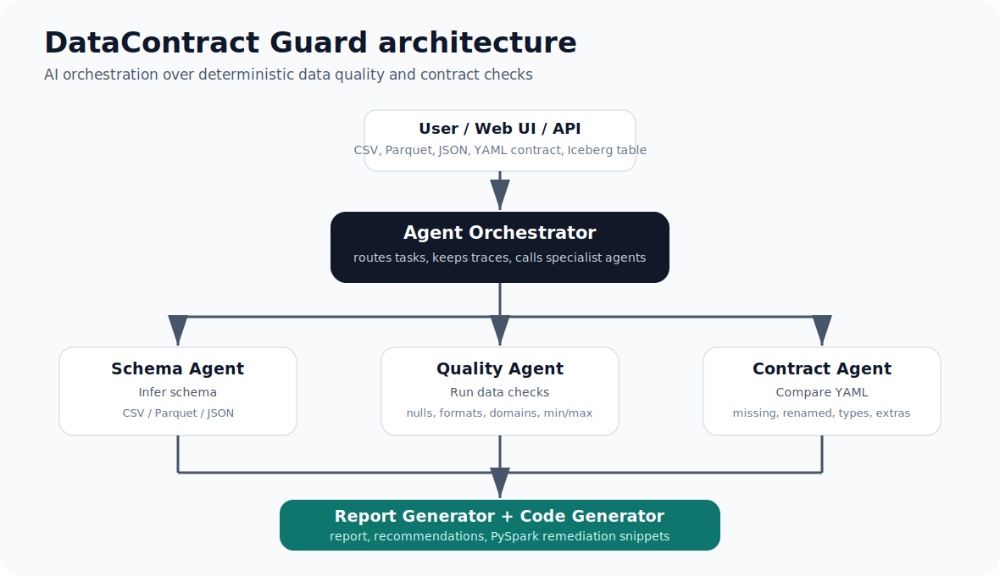
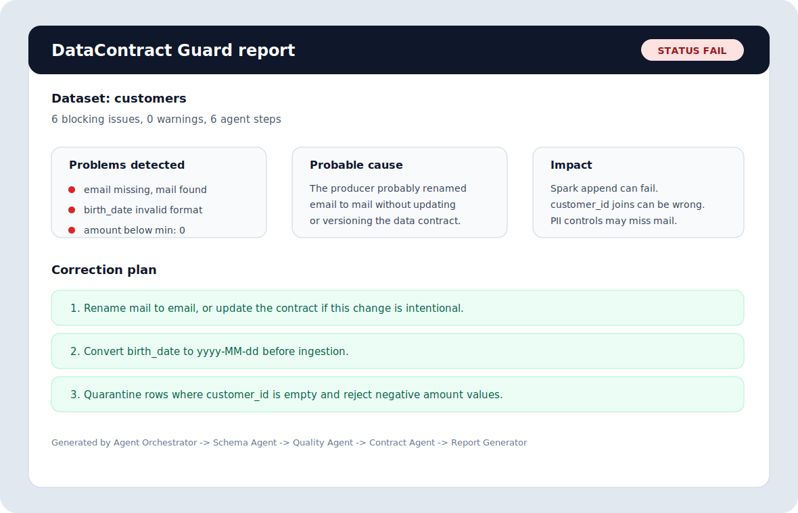
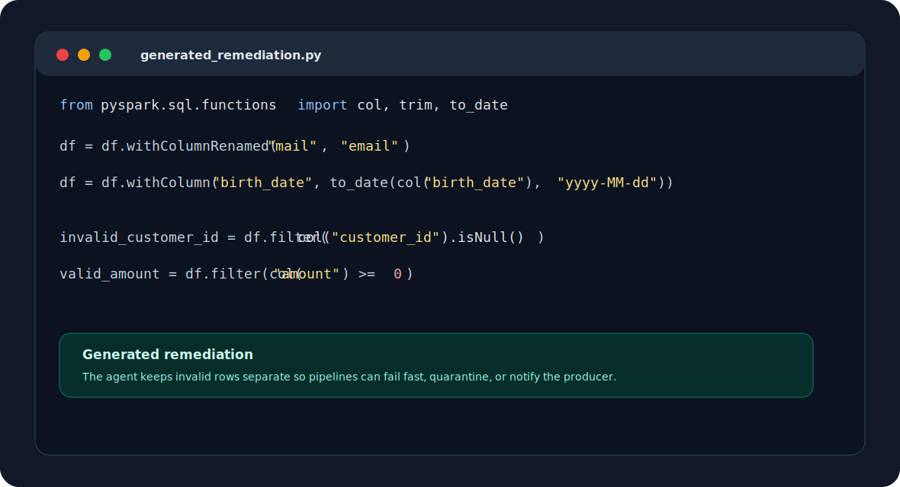

# DataContract Guard

Validate incoming data before it breaks your pipelines.

**DataContract Guard** is an AI-assisted Data Quality / Data Contract agent for
data engineers. It checks CSV, JSON, Parquet, and contract metadata before data
is appended to Spark, warehouse, or Iceberg pipelines.

Promise:

> Validate received data against your contract, understand the drift, and get a
> remediation plan before ingestion.

The agent does more than technical validation:

1. it checks received data against the expected contract;
2. it connects weak signals, such as `email` missing while `mail` is present;
3. it explains the likely cause, business impact, and correction plan.



## Functional Architecture

The runtime is intentionally split into agents:

- `Agent Orchestrator`: routes the request and keeps the execution trace;
- `Schema Agent`: infers the real schema from CSV, JSON, or Parquet;
- `Contract Agent`: loads the YAML contract and detects schema drift;
- `Quality Agent`: validates nulls, formats, patterns, domains, and business rules;
- `Report Generator`: merges findings, explains impact, recommends fixes, and generates code.
- `LLM Explanation Agent`: turns the JSON report into a clear explanation,
  business impact, proposed correction, and supplier message.

## Why This Is Different

Classic validators stop at facts such as `Column email is missing`.

DataContract Guard turns those facts into an operational diagnosis:

- it detects that `email` is missing and `mail` is suspiciously similar;
- it explains that the producer probably renamed the field without versioning the contract;
- it links the issue to Spark failures, Iceberg append risk, joins on `customer_id`, finance dashboards, and PII controls;
- it proposes concrete actions, not just errors;
- it generates remediation code that a data engineer can adapt directly in Spark.

The deterministic engine remains the source of truth for `PASS` / `FAIL`. The
agent layer explains, prioritizes, and recommends.

## Report Screenshots

Failure report:



Generated Spark remediation:



## What It Does

- reads a source schema from JSON;
- infers a schema from a CSV sample;
- infers a schema from Parquet when optional `pyarrow` is installed;
- reads a YAML data contract;
- detects missing columns;
- detects renamed columns;
- detects incompatible type changes;
- detects extra source columns;
- detects empty required values;
- detects invalid date and timestamp formats;
- detects invalid values with patterns or allowed value lists;
- detects numeric business rules such as `min` and `max`;
- explains probable causes and business impact;
- proposes corrections;
- generates JSON or Markdown reports with remediation code.

## Project Tree

```text
datacontract-guard/
  app/
    main.py                 FastAPI application
    routes/
      validations.py        POST /validate endpoint
    services/
      validation_service.py upload handling and validation service
  contract_agent/
    agents/
      orchestrator.py   functional agent orchestration
      schema_agent.py   source schema inference agent
      quality_agent.py  row-level data quality agent
      contract_agent.py contract loading and comparison agent
      report_agent.py   final report and recommendations agent
      code_generator.py PySpark remediation snippets
      llm_explanation_agent.py explain report JSON without changing PASS/FAIL
    core/
      agent.py          contract comparison use case
      data_quality.py   row-level quality checks
      explainer.py      agent-style cause, impact, and fix analysis
      contract.py       contract model mapping
      models.py         schemas, issues, corrections, reports
      reporting.py      JSON and Markdown rendering
    adapters/
      mini_yaml.py      small dependency-free YAML parser
      schema_reader.py  JSON/CSV source schema readers
    enterprise/
      costs.py          budget and cost estimates
      logging.py        JSON logs
      runtime.py        guarded evaluation runtime
      security.py       API keys and path allow-listing
      settings.py       environment configuration
      tracing.py        per-request spans
    api/
      http.py           dependency-free HTTP API
    cli.py              command-line agent
    evaluation.py       response evaluation runner
  examples/
    customer_contract.yaml
    source_schema.json
    source_sample.csv
    supplier_contract.yaml
    supplier_bad.csv
    customers_contract.yaml
    customers_bad.csv
    evaluation_cases.json
  docs/
    assets/
      datacontract-guard-architecture.svg
      report-failure-screenshot.svg
      spark-code-screenshot.svg
  tests/
  Dockerfile
  docker-compose.yml
  pyproject.toml
```

## Get Started

From this directory:

```powershell
python -B -m contract_agent.cli `
  --source-schema .\examples\source_schema.json `
  --contract .\examples\customer_contract.yaml
```

Expected result: the report fails because:

- `customer_id` is `string` in the source but `long` in the contract;
- `signup_ts` is missing from the source;
- `created_at` and `marketing_opt_in` are extra source columns.

Generate JSON:

```powershell
python -B -m contract_agent.cli `
  --source-schema .\examples\source_schema.json `
  --contract .\examples\customer_contract.yaml `
  --output json
```

Write a Markdown report:

```powershell
python -B -m contract_agent.cli `
  --source-schema .\examples\source_schema.json `
  --contract .\examples\customer_contract.yaml `
  --report-file .\contract-report.md
```

A generated example is available at `examples/sample-report.md`.

Infer a schema from a CSV sample:

```powershell
python -B -m contract_agent.cli `
  --source-schema .\examples\source_sample.csv `
  --contract .\examples\customer_contract.yaml
```

Validate a received supplier file against the expected contract:

```powershell
python -B -m contract_agent.cli `
  --source-schema .\examples\supplier_bad.csv `
  --contract .\examples\supplier_contract.yaml `
  --source-name supplier.payment_file
```

Expected result: the report fails because:

- `email` appears to have been renamed to `mail`;
- `birth_date` uses `01/01/1990` instead of `%Y-%m-%d`;
- one `amount` value cannot be parsed as a decimal.

If your schema is stored separately from the data sample, pass both files:

```powershell
python -B -m contract_agent.cli `
  --source-schema .\examples\source_schema.json `
  --data-file .\examples\supplier_bad.csv `
  --contract .\examples\supplier_contract.yaml
```

Parquet files are supported when `pyarrow` is available in the runtime image.
Without it, the agent returns a clear configuration error.

Run the complete agent scenario:

```powershell
python -B -m contract_agent.cli `
  --source-schema .\examples\customers_bad.csv `
  --contract .\examples\customers_contract.yaml `
  --source-name customers
```

The agent explains that:

- the required `email` column is missing while a similar `mail` column exists;
- the producer probably renamed `email` to `mail`;
- `birth_date` contains a value in `01/01/1990` instead of `%Y-%m-%d`;
- `customer_id` contains empty required values;
- `amount` contains negative values while the contract declares `min: 0`;
- Spark jobs, Iceberg appends, joins on `customer_id`, finance dashboards, and
  privacy controls can be impacted.

## Complete Example: CSV KO -> Report -> Spark Code

Input file received from a producer:

```csv
customer_id,mail,birth_date,amount
,test@gmail.com,01/01/1990,25.5
,second@gmail.com,1990-01-02,-3
789,third@gmail.com,1990-02-03,-1
```

Expected contract:

```yaml
name: customers_contract
version: 1.0.0
owner: customer-data
columns:
  - name: customer_id
    type: long
    required: true
  - name: email
    type: string
    required: true
    pattern: ^[^@]+@[^@]+\.[^@]+$
  - name: birth_date
    type: date
    required: true
    format: "%Y-%m-%d"
  - name: amount
    type: double
    required: true
    min: 0
```

Run DataContract Guard:

```powershell
python -B -m contract_agent.cli `
  --source-schema .\examples\customers_bad.csv `
  --contract .\examples\customers_contract.yaml `
  --source-name customers
```

Report excerpt:

```text
Dataset: customers
Status: FAIL

Problems detected:
1. Required column "email" is missing. Similar column "mail" is present.
2. "birth_date" contains an invalid format. Expected: %Y-%m-%d.
3. 2 null values were detected in required column "customer_id".
4. "amount" contains values below the minimum 0.

Impact:
- Spark or Iceberg append can fail.
- Joins on customer_id can produce wrong metrics.
- Finance dashboards can be wrong because amount contains negative values.
- PII controls may miss the renamed email field.

Recommended correction:
- Rename mail to email, or update the contract if this change is intentional.
- Convert birth_date to yyyy-MM-dd before ingestion.
- Quarantine rows where customer_id is empty.
- Reject rows where amount is lower than 0.
```

Generated Spark remediation:

```python
from pyspark.sql.functions import col, trim, to_date

df = df.withColumnRenamed("mail", "email")
df = df.withColumn("birth_date", to_date(col("birth_date"), "yyyy-MM-dd"))

invalid_customer_id = df.filter(
    col("customer_id").isNull() | (trim(col("customer_id")) == "")
)
valid_customer_id = df.filter(
    col("customer_id").isNotNull() & (trim(col("customer_id")) != "")
)

valid_amount = valid_customer_id.filter(col("amount") >= 0)
invalid_amount = valid_customer_id.filter(col("amount") < 0)
```

## Contract Format

```yaml
name: customer_profile_contract
version: 1.0.0
owner: data-platform
columns:
  - name: customer_id
    type: long
    required: true
    description: Stable customer identifier
  - name: email
    type: string
    required: true
  - name: signup_ts
    type: timestamp
    required: true
    format: "%Y-%m-%dT%H:%M:%SZ"
  - name: country
    type: string
    required: false
    allowed_values: [FR, US, MA]
  - name: amount
    type: double
    required: true
    min: 0
```

The starter parser supports the simple YAML shape above. If your contracts
become more complex, replace `contract_agent/adapters/mini_yaml.py` with PyYAML
or your platform parser.

## Source Schema Format

```json
{
  "name": "bronze.customer_profile",
  "columns": [
    { "name": "customer_id", "type": "string" },
    { "name": "email", "type": "string" }
  ]
}
```

## Configuration and Settings

Runtime configuration is provided via environment variables and centralized by
the `Settings` dataclass (`contract_agent.enterprise.settings.Settings`). For
full details see the Settings documentation: [docs/SETTINGS.md](docs/SETTINGS.md#L1-L1).

Minimal example with MCP (Managed Connector Proxy)

```powershell
# point to your MCP server and provide a bearer token
$env:DATA_CONTRACT_MCP_URL = 'https://mcp.internal.example'
$env:DATA_CONTRACT_MCP_TOKEN = 's3cr3t-token'

python -B -m contract_agent.cli `
  --source-schema 'datasource.table' `
  --contract 'repo:contracts/customer_contract.yaml'
```

Optional vector store (for LLM explanation enrichment)

```powershell
# enable and configure local Chroma store
$env:DATA_CONTRACT_ENABLE_VECTOR_STORE = 'true'
$env:DATA_CONTRACT_DOCS_PATH = '.\docs'
$env:DATA_CONTRACT_VECTOR_STORE_PATH = '.\.chroma_store'

# install optional extras before using vector features
pip install -e .[vector]
```


## Correction Examples

The agent can propose actions such as:

- `ADD_SOURCE_COLUMN`: add a missing required column upstream;
- `RENAME_SOURCE_COLUMN`: restore a renamed source field;
- `CAST_SOURCE_COLUMN`: cast a source column to the contract type;
- `NORMALIZE_DATE_FORMAT`: convert dates or timestamps to the expected format;
- `CAST_OR_CLEAN_VALUE`: clean values that cannot be parsed as the expected type;
- `FIX_VALUE_PATTERN`: clean values that do not match a regex pattern;
- `ENFORCE_MIN_VALUE`: reject values below a declared minimum;
- `UPDATE_CONTRACT_TYPE`: accept a safe promotion in the contract;
- `ADD_CONTRACT_COLUMN`: add an intentional new source field to the contract.

## Agent Output

Each API or JSON CLI response contains:

- `issues`: technical contract and quality findings;
- `corrections`: machine-readable actions;
- `agent.steps`: executed agents and their summaries;
- `analysis.problems`: human-readable explanation;
- `analysis.probableCauses`: inferred causes;
- `analysis.impacts`: Spark, Iceberg, BI, join, and privacy risks;
- `analysis.correctionPlan`: recommended remediation steps;
- `recommendations`: flattened action plan;
- `generatedCode`: PySpark snippets to fix or quarantine bad data.
- `llmExplanation`: clear explanation, business impact, proposed correction,
  and a supplier-facing message.

`llmExplanation.status` is copied from the deterministic validation engine. The
LLM Explanation Agent is not allowed to calculate or override `PASS` / `FAIL`.

Example explanation:

```text
La colonne obligatoire "email" est absente. Une colonne similaire "mail" est présente.
Il est probable que le producteur ait renommé "email" en "mail".
Risque que les contrôles RGPD/PII ne s'appliquent plus au bon champ.
Renommer "mail" en "email" ou mettre à jour le contrat si le changement est volontaire.
```

## Documentation

Project documentation and architecture diagrams are kept under the `docs/` folder:

- [Architecture overview](docs/ARCHITECTURE.md)
- [Data model and schema](docs/SCHEMA.md)


## CI Gate

```powershell
python -B -m contract_agent.cli `
  --source-schema .\examples\source_schema.json `
  --contract .\examples\customer_contract.yaml `
  --output json
```

Exit code is `1` when the report status is `FAIL`.

## Enterprise Guardrails

The runtime includes operational controls that make the prototype safer to run
in a real platform:

- guardrails: allowed root directories, max input file size, max request body;
- logging: JSON structured events written to stderr;
- tracing: every evaluation returns a `traceId`, elapsed time, and spans;
- response evaluation: golden cases validate expected issues and corrections;
- automated tests: `unittest` suite for core, API, guardrails, and evaluation;
- cost management: column budgets and estimated comparison units;
- secret management: API key read only from environment variables;
- tool security: API requests cannot read files outside configured roots;
- limited permissions: container runs read-only, with no extra Linux capabilities;
- API deployment: local HTTP server plus Docker Compose.

## Configuration

Use environment variables for deployment-specific controls:

```text
DATA_CONTRACT_ENV=production
DATA_CONTRACT_ALLOWED_ROOTS=/contracts;/schemas
DATA_CONTRACT_MAX_FILE_BYTES=5242880
DATA_CONTRACT_MAX_COLUMNS=500
DATA_CONTRACT_MAX_CONTRACT_COLUMNS=500
DATA_CONTRACT_MAX_DATA_ROWS=1000
DATA_CONTRACT_API_KEY=replace-with-secret-manager-value
DATA_CONTRACT_LOG_LEVEL=INFO
```

`DATA_CONTRACT_ALLOWED_ROOTS` is semicolon-separated. Relative request paths are
resolved from the first allowed root. In production, inject
`DATA_CONTRACT_API_KEY` from your secrets manager rather than committing it.

## API

Start the FastAPI application:

```powershell
uvicorn app.main:app --host 127.0.0.1 --port 8093 --reload
```

Validate an uploaded file:

```bash
curl -X POST http://127.0.0.1:8093/validate \
  -F "data_file=@examples/customers_bad.csv" \
  -F "contract_file=@examples/customers_contract.yaml" \
  -F "source_name=customers"
```

`POST /validate` accepts multipart form data:

- `data_file`: CSV, JSON, or Parquet file to validate;
- `contract_file`: YAML, YML, or JSON contract;
- `source_name`: dataset name shown in the report.

It returns a `ValidationReport` with:

- `status`, `counts`, `issues`, `corrections`;
- `analysis`, `recommendations`, `generatedCode`;
- `agent.steps`, `trace`, and `cost`.

Legacy dependency-free API:

```powershell
python -B .\api_server.py --host 127.0.0.1 --port 8093
```

Health check:

```powershell
Invoke-RestMethod http://127.0.0.1:8093/api/health
```

Evaluate a schema against a contract:

```powershell
Invoke-RestMethod `
  -Method Post `
  -Uri http://127.0.0.1:8093/api/evaluate `
  -ContentType "application/json" `
  -Headers @{ Authorization = "Bearer $env:DATA_CONTRACT_API_KEY" } `
  -Body (Get-Content -Raw .\examples\api-evaluate-request.json)
```

The API also accepts `dataFilePath` and `validateData`:

```json
{
  "sourceSchemaPath": "examples/supplier_bad.csv",
  "contractPath": "examples/supplier_contract.yaml",
  "sourceName": "supplier.payment_file",
  "validateData": true
}
```

If `DATA_CONTRACT_API_KEY` is empty, local API authentication is disabled.

## Response Evaluation

Run golden evaluation cases:

```powershell
python -B -m contract_agent.evaluation --eval-file .\examples\evaluation_cases.json
```

The command exits with code `1` if expected statuses, issue checks, or correction
actions drift.

## API Deployment

Run the containerized API:

```powershell
docker compose up --build
```

The Compose profile binds `8093`, keeps the container filesystem read-only, uses
`/tmp` as tmpfs, drops Linux capabilities, and blocks privilege escalation.

## Airflow Integration

```python
from pathlib import Path
from contract_agent.adapters.schema_reader import read_contract, read_source_schema
from contract_agent.core.agent import DataContractAgent

contract = read_contract(Path("/contracts/customer_contract.yaml"))
source = read_source_schema(Path("/schemas/customer_profile.json"))
report = DataContractAgent().evaluate(source, contract)

if report.status == "FAIL":
    raise RuntimeError(report.as_dict())
```

## Tests

```powershell
python -B -m unittest discover -s tests
```
