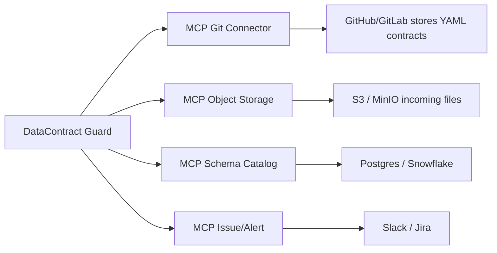
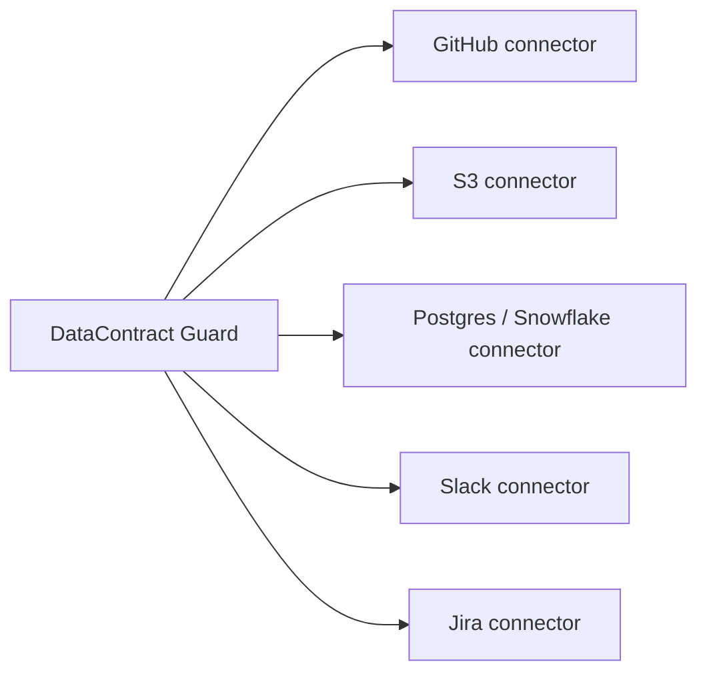

# Data Contract Agent — Architecture

This document describes the runtime architecture and the schema model used by DataContract Guard.

**High-level components**

- Agent Orchestrator: routes a user evaluation request to specialized agents and aggregates results.
- Schema Agent: infers a schema from source files (CSV/JSON/Parquet).
- Contract Agent: loads the contract (YAML/JSON) and compares it to inferred schema.
- Quality Agent: runs row-level data quality checks (formats, patterns, domains, nullability).
- Report Generator: merges schema and quality findings and prepares recommendations and code snippets.
- LLM Explanation Agent: generates human-friendly explanations and supplier messages; optionally enriched by a Document Retriever (ChromaDB).

Optional components:

- Document Retriever (ChromaDB): local vector store that indexes `docs/*.md` and provides contextual references to the explanation agent.

```mermaid
flowchart LR
  A[API / CLI] --> B(Agent Orchestrator)
  B --> C[Schema Agent]
  B --> D[Contract Agent]
  B --> E[Quality Agent]
  C --> F[Report Generator]
  D --> F
  E --> F
  F --> G[LLM Explanation Agent]
  G -->|optional| H[Document Retriever (Chroma)]
  G --> I[Output: JSON / Markdown]
```

**Deployment notes**

- The runtime is dependency-light; vector search is optional. If `chromadb` and `sentence-transformers` are installed and `DATA_CONTRACT_ENABLE_VECTOR_STORE=true`, the agent will index `docs/*.md` into a local Chroma collection and will include short document excerpts in LLM prompts.
- The deterministic validation engine remains authoritative for the `PASS`/`FAIL` status; LLMs only generate explanations and remediation suggestions.

See `SCHEMA.md` for the data model details and example payloads.

## MCP Connectors (GitHub/GitLab, S3, Databases, Slack/Jira)

This project can integrate with external connectors in two ways: directly (each connector implemented in the agent) or via standardized MCP servers that act as connector adapters.

MCP (Managed Connector Proxy) servers standardize access to third-party systems and hide auth/config complexity. The DataContract Guard can use existing internal MCP servers to read contracts, list incoming files, query schemas, or emit alerts.

Benefits of using MCP:

- Centralized credentials and secrets management (no hard-coded tokens in the agent).
- Reusable connector logic across agents and projects.
- Standardized API (same high-level calls for Git, object storage, databases, messaging).
- Easier auditing, rate-limiting and observability at connector boundary.

Example flows

With MCP (recommended):



Without MCP (each connector embedded in the agent):



Operational note: when MCP servers exist in your platform, prefer calling them. The agent's adapters should implement a thin interface so the same business logic can call either the MCP endpoint or a local connector implementation.

Security and deployment

- Use short-lived service tokens for MCP-to-third-party calls.
- Scope MCP permissions narrowly (read-only for contracts, write to specific issue channels for alerts).
- Prefer internal network connectivity between the agent and MCP servers (VPC, service mesh).

See `MCP_CONNECTORS.md` for implementation guidance and an example connector interface.
