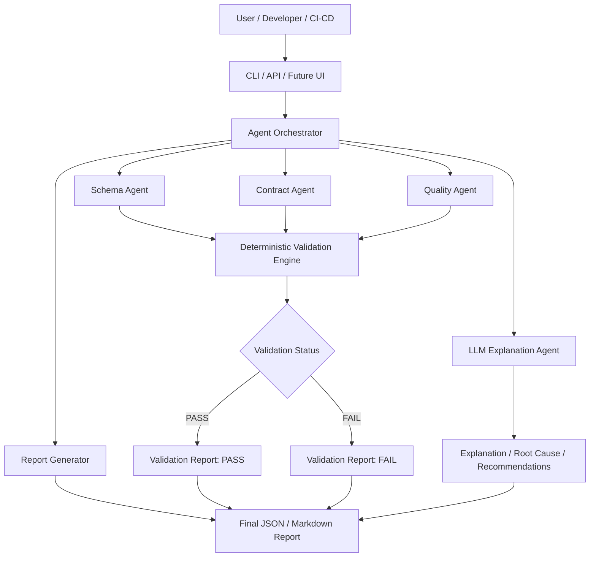
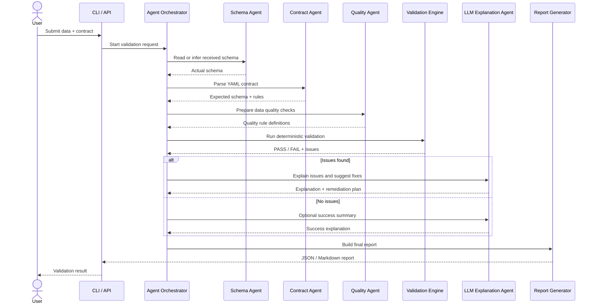

# Architecture

DataContract Guard is designed as a modular validation system with an agent-style runtime.

The goal of the architecture is simple:

- validate data contracts in a deterministic way;
- explain validation issues clearly;
- generate actionable remediation recommendations;
- integrate easily with CLI, API, Docker, CI/CD and future UI workflows.

> The deterministic validation engine is the source of truth.  
> The agent layer explains, prioritizes and recommends.

## 1. High-Level Architecture



---

## 2. Runtime Validation Flow



## 3. Components

### a. Agent Orchestrator

Coordinates the validation workflow.

Responsibilities:

- Receive the validation request
- Load the source schema or data file
- Load the contract
- Call specialized agents
- Merge results into a final report
- Keep execution traces

### b. Schema Agent

Responsible for understanding the received data structure.

Responsibilities:

- Read a JSON schema
- Infer a schema from CSV
- Infer a schema from Parquet when supported
- Extract column names and detected types
- Provide basic profiling metadata

### c. Contract Agent

Responsible for reading and validating the expected contract.

Responsibilities:

- Parse YAML contracts
- Validate contract structure
- Normalize contract column definitions
- Extract expected types and quality rules

### d. Quality Agent

Responsible for applying data quality rules.

Responsibilities:

- Check required columns
- Check missing values
- Check regex constraints
- Check allowed values
- Check min/max values
- Check date and timestamp formats

### e. LLM Explanation Agent

Optional component used to enrich deterministic validation output.

Responsibilities:

- Explain issues in natural language
- Identify likely producer-side causes
- Describe business and technical impacts
- Generate remediation plans
- Generate messages for data producers

Important: this agent must not be the source of truth for validation status.

### f. Report Generator

Responsible for formatting validation results.

Responsibilities:

- Generate JSON reports
- Generate Markdown reports
- Summarize issues
- Add recommendations
- Add generated remediation code

## Recommended Package Structure

```text
datacontract-guard/
│
├── app/
│   ├── main.py
│   ├── routes/
│   │   └── validations.py
│   └── services/
│       └── validation_service.py
│
├── contract_agent/
│   ├── agents/
│   │   ├── orchestrator.py
│   │   ├── schema_agent.py
│   │   ├── contract_agent.py
│   │   ├── quality_agent.py
│   │   ├── report_agent.py
│   │   ├── code_generator.py
│   │   └── llm_explanation_agent.py
│   │
│   ├── core/
│   │   ├── contract.py
│   │   ├── models.py
│   │   ├── data_quality.py
│   │   ├── explainer.py
│   │   └── reporting.py
│   │
│   ├── adapters/
│   │   ├── schema_reader.py
│   │   └── mini_yaml.py
│   │
│   ├── enterprise/
│   │   ├── settings.py
│   │   ├── security.py
│   │   ├── logging.py
│   │   ├── runtime.py
│   │   ├── tracing.py
│   │   └── costs.py
│   │
│   ├── cli.py
│   └── evaluation.py
│
├── examples/
├── docs/
├── tests/
├── Dockerfile
├── docker-compose.yml
└── pyproject.toml
```

---

## Design Principles

### 1. Deterministic First

Validation must be reproducible. The system should always return the same result for the same input.

The LLM should explain and recommend, not decide the final validation status.

---

### 2. Agent-Assisted, Not Agent-Only

Agents are used to organize responsibilities:

- Schema Agent
- Contract Agent
- Quality Agent
- Report Agent
- Explanation Agent

This improves maintainability and makes the system easier to extend.

---

### 3. API, CLI, and CI/CD Friendly

The same validation engine should be usable from:

- CLI
- FastAPI
- Docker
- GitLab CI
- Airflow
- Future UI

---

### 4. Secure by Default

The system should avoid unsafe filesystem access, uncontrolled LLM actions, and secret exposure.

Recommended safeguards:

- Allowed root directories
- Max file size
- Read-only container filesystem
- No direct production writes
- Explicit human approval for sensitive actions

---

## Future Architecture

```text
Frontend UI
    ↓
FastAPI Backend
    ↓
Agent Orchestrator
    ↓
Deterministic Validation Engine
    ↓
LLM Explanation Agent
    ↓
RAG Knowledge Base
    ↓
Connectors / MCP Servers
    ├── GitHub / GitLab
    ├── S3
    ├── Glue Catalog
    ├── Iceberg Catalog
    ├── Slack / Teams
    └── Jira
```
